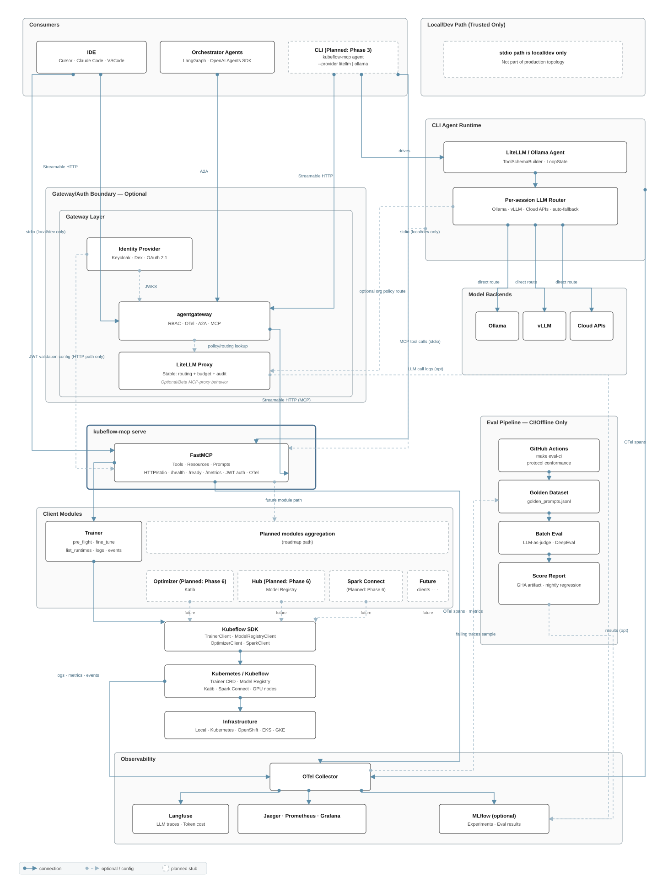

# Architecture Overview

This document describes the Kubeflow MCP Server architecture in two parts: the **current state**
of the `main` branch, and the **planned target architecture** shown in the diagram below.

For the phased delivery plan, see [ROADMAP.md](ROADMAP.md).
For contributing guidelines, see [CONTRIBUTING.md](CONTRIBUTING.md).

---

## Current Architecture

### What ships today

```
IDE (Cursor · Claude Code · VSCode)
Orchestrator Agent
         │
         │  stdio  │  Streamable HTTP  │  SSE (legacy)
         ▼
┌────────────────────────────────────────────-─┐
│  kubeflow-mcp serve  (FastMCP)               │
│                                              │
│  Auth          Bearer token · JWT (JWKS)     │
│  Policy        Persona-based tool filter     │
│  Tool modes    full · progressive · semantic │
│  Resilience    Rate limiter · Circuit breaker│
│  Health        /health · /ready              │
│  Security      Input validation · masking    │
└──────────────────────┬──────────────────────-┘
                       │  Kubeflow SDK
                       ▼
               Trainer (23 tools)
               Optimizer stub · Hub stub
                       │
                       ▼
               Kubernetes / Kubeflow Trainer v2
               │
               Infrastructure
               Local · Kind · OpenShift · EKS · GKE
```

---

## Target Architecture

The diagram below shows the full target architecture (Phases 1–6). Sections not yet available in
`main` are marked **Planned**.



### Planned additions

#### CLI Agent Runtime — Phase 3 ([#15](https://github.com/kubeflow/mcp-server/issues/15))

A new `kubeflow-mcp agent` command with a common `AgentProvider` protocol and a per-session
LLM router supporting multiple backends.

```
kubeflow-mcp agent --provider litellm | ollama
         │
LiteLLM / Ollama Agent  →  Per-session LLM Router
         │
         ├──► Ollama       (local inference · thinking mode)
         ├──► vLLM         (self-hosted GPU serving)
         ├──► Cloud APIs   (OpenAI · Anthropic · Gemini · …)
         └──► auto-fallback
         │
         │  MCP tool calls (stdio)
         ▼
kubeflow-mcp serve
```

#### Observability — Phase 2 (available)

OTel tracing is available via [#21](https://github.com/kubeflow/mcp-server/pull/21) using the
[MCP semantic conventions](https://opentelemetry.io/docs/specs/semconv/gen-ai/mcp/).

```
kubeflow-mcp serve ──►                  ┌──► Jaeger · Prometheus · Grafana
CLI Agent Runtime  ──► OTel Collector ──┤
Kubernetes cluster ──►                  ├──► MLflow  (optional — if MLFLOW_TRACKING_URI set)
                                        └──► Langfuse (LLM traces + token cost)
```

Enable with `--otel-endpoint <url>` or `OTEL_EXPORTER_OTLP_ENDPOINT`.

#### Gateway Layer — Phase 4

`kubeflow-mcp serve` is single-tenant today — one token, one persona, one cluster. Phase 4 absorbs
five gateway capabilities natively, making the external gateway stack **opt-in** for most teams.

The design boundary:

- **Absorb natively** — identity (OIDC/OAuth 2.1), K8s RBAC (`SubjectAccessReview`), per-user rate
  limiting, MCP Server Card, and A2A delegation. These are single-server concerns that shouldn't
  require a sidecar proxy.
- **Stay external permanently** — LiteLLM Proxy (org-level LLM budget enforcement) and
  agentgateway (multi-server MCP federation is by definition a routing-layer concern).

Target topology for a standard single-team deployment after Phase 4:

```
Consumers
    │  Streamable HTTP (OIDC-authenticated)
    ▼
kubeflow-mcp serve
  ├─ OIDC / OAuth 2.1 native auth
  ├─ K8s RBAC per caller (SubjectAccessReview)
  ├─ Per-user rate limiting
  ├─ MCP Server Card (/.well-known/mcp.json)
  └─ A2A endpoint (/a2a)
```

The full gateway stack (agentgateway + LiteLLM Proxy) remains available for orgs that need
multi-server federation or org-wide LLM cost control. See [ROADMAP.md — Phase 4](ROADMAP.md#phase-4--enterprise--in-cluster-to-do) for the complete delivery list.

#### Eval Pipeline — Phase 2 ([#10](https://github.com/kubeflow/mcp-server/issues/10))

Not part of the serving path. Three tiers to balance speed, cost, and signal quality:

**Tier 1 — Every PR** (fast · free · deterministic)
```
GitHub Actions
    │
Rule-based safety judges
  · confirm gate never submits with confirmed=False
  · pre_flight runs before fine_tune
  · destructive tools blocked for readonly / data-scientist personas
  · MCP protocol conformance (tool schema, response types)
```

**Tier 2 — Nightly on main** (LLM judge · costs money)
```
Scheduled GitHub Actions
    │
Golden Dataset → LLM-as-judge + DeepEval
    │
Score Report → GHA artifact          (always)
            → MLflow                 (optional — if MLFLOW_TRACKING_URI is set)
            ← compare eval/baseline.json → fail run on regression
```

**Tier 3 — On-demand** (release candidates / major feature PRs)
```
Triggered manually by maintainer
    │
Full eval run → GHA artifact + PR comment (score delta)
             → update eval/baseline.json intentionally
```

> LLM judges run **nightly / on-demand only** — never per-PR. Per-PR LLM judging causes
> non-deterministic CI failures, unbounded API costs, and slow feedback loops.

---

## Security Model

For vulnerability reporting and disclosure, see [SECURITY.md](SECURITY.md).

### Trust Boundaries

```
AI Agent (Claude, Cursor, etc.)
    │
    ▼
MCP Server process  ← YOU ARE HERE (kubeflow-mcp)
    │
    ▼
Kubeflow SDK (TrainerClient)
    │
    ▼
Kubernetes API Server (RBAC enforced)
```

### What the MCP Server Controls

- **Persona-based tool filtering** — restricts which tools are visible to the AI agent (default: `--persona readonly`, which hides all write tools)
- **Policy file** — `~/.kf-mcp-policy.yaml` can further restrict tools and namespaces
- **Two-phase confirmation** — write tools require `confirmed=True` (preview first, submit after)
- **Input validation** — K8s name format, CPU/memory format, resource limits, training parameter bounds (batch_size, epochs, nodes, GPU count, LoRA rank, script size, package count)
- **Namespace restrictions** — policy enforcement on both lifecycle and training tools (training tools use per-call `TrainerClient` with `KubernetesBackendConfig(namespace=...)`)
- **Error sanitization** — stack traces are only included in error responses when the logger is at DEBUG level; production responses contain error messages only
- **External API hardening** — HuggingFace Hub calls use a 10s timeout and model ID format validation (`org/model` regex) to prevent SSRF; malformed model IDs return suggestions via `huggingface_hub.list_models` (best-effort, degrades gracefully on network failure)
- **Thread safety** — `RateLimiter` uses `threading.Lock`; policy cache uses `functools.lru_cache` (GIL-safe); policy reload uses a dedicated `threading.Lock`
- **Audit logging** — every tool call is logged with masked parameters, duration, and correlation ID; log buffer redacts sensitive patterns (tokens, passwords, credentials) before storage
- **Observability** — opt-in OpenTelemetry tracing via `--otel-endpoint` or `OTEL_EXPORTER_OTLP_ENDPOINT`. Each tool call emits a span with `tool.args_preview` (masked, truncated to 300 chars), persona, correlation ID, MCP session/request IDs, and error status. OTLP exporter uses a 2s timeout to avoid blocking tool calls. Tracing is no-op when OTel packages are not installed

### What the MCP Server Does NOT Control

- **Kubernetes RBAC** — all tool calls use the server process Kubeconfig / ServiceAccount; HTTP auth does not map callers to distinct Kubernetes identities (see Identity below)
- **Network security** — TLS, ingress, and API gateway configuration are infrastructure concerns
- **Secret management** — the server does not store credentials; it reads Kubeconfig from the environment

### Known Security Considerations

#### 1. `run_custom_training` — Host Code Execution (High)

The tool accepts a Python script string, wraps it inside `def train():`, and calls `exec()` on the host to define the function — the body runs later in the training pod. `compile()` + `exec()` execute at submission time, so malformed scripts could affect the host process.

**Mitigated:** AST safety check (`is_safe_python_code`) blocks dangerous patterns (eval/exec/subprocess/ctypes/dunder access) on both preview and submit paths. Unsafe scripts are rejected by default; `KUBEFLOW_MCP_UNSAFE_SCRIPTS=true` overrides.

**Not mitigated:** AST check is bypassable via indirection (`getattr`, `importlib`). No sandbox or seccomp inside the pod. Script runs with the pod's full ServiceAccount privileges.

**Recommendation:** Restrict to trusted users via `--persona data-scientist` or higher.

#### 2. HTTP Transport — Authentication

**Severity: Medium** | **Status: Mitigated (API key + JWT implemented)**

`kubeflow-mcp serve --transport http` exposes the MCP server over StreamableHTTP. Authentication is available via `--auth-token` (API key) or `KUBEFLOW_MCP_JWKS_URI` (JWT/OIDC). The server logs a warning if HTTP transport runs without any auth configured.

**Recommendation:** Always configure `--auth-token` or JWT for HTTP transport. Use stdio transport for local development. For production, place behind an authenticating reverse proxy with TLS for defense-in-depth.

#### 3. Identity — Per-User Mapping

**Severity: Medium** | **Status: Open, tracked in [ROADMAP.md](ROADMAP.md) Step 3**

`core/auth.py` implements HTTP-layer authentication (API key via `--auth-token`, JWT/OIDC via `KUBEFLOW_MCP_JWKS_URI`). However, authenticated identities are not yet mapped to distinct Kubernetes identities. All tool calls run under whatever Kubeconfig the process was started with.

**Impact:** In multi-user deployments, all users share the same Kubernetes identity. There is no per-user RBAC enforcement at the MCP layer (the auth layer verifies *who* is calling, but cannot scope *what* they can do beyond persona-level filtering).

**Recommendation:** For single-user local development (stdio), this is acceptable — the user's own Kubeconfig is used. For multi-user HTTP deployments, configure `--auth-token` or JWT and enforce identity at the ingress/gateway layer until per-user Kubernetes impersonation is wired (Step 3).

### Recommended Deployment Practices

```yaml
# 1. Run in isolated namespace
apiVersion: v1
kind: Namespace
metadata:
  name: kubeflow-mcp
  labels:
    pod-security.kubernetes.io/enforce: restricted

---
# 2. Use NetworkPolicy to restrict access
apiVersion: networking.k8s.io/v1
kind: NetworkPolicy
metadata:
  name: mcp-server-ingress
  namespace: kubeflow-mcp
spec:
  podSelector:
    matchLabels:
      app: kubeflow-mcp
  policyTypes:
    - Ingress
  ingress:
    - from:
        - namespaceSelector:
            matchLabels:
              trusted: "true"
      ports:
        - port: 8000
```

### RBAC Configuration

#### Minimum ClusterRole for MCP Server

```yaml
apiVersion: rbac.authorization.k8s.io/v1
kind: ClusterRole
metadata:
  name: kubeflow-mcp-server
rules:
  # Health: health_check probes list_namespace
  - apiGroups: [""]
    resources: ["namespaces"]
    verbs: ["list"]

  # Planning: get_cluster_resources / platform detection
  - apiGroups: [""]
    resources: ["nodes"]
    verbs: ["list"]

  # Planning: check_compatibility reads the Trainer CRD
  - apiGroups: ["apiextensions.k8s.io"]
    resources: ["customresourcedefinitions"]
    verbs: ["get"]

  # Discovery + Monitoring: list/get jobs, logs, events
  - apiGroups: ["trainer.kubeflow.org"]
    resources: ["trainjobs"]
    verbs: ["list", "get", "create", "delete", "patch"]
  - apiGroups: [""]
    resources: ["pods", "pods/log", "events"]
    verbs: ["list", "get"]

  # Discovery: list/get runtimes; Platform: patch/create/delete runtimes
  - apiGroups: ["trainer.kubeflow.org"]
    resources: ["clustertrainingruntimes"]
    verbs: ["list", "get", "create", "delete", "patch"]
```

#### Read-Only ClusterRole

For `--persona readonly` or monitoring-only deployments:

```yaml
apiVersion: rbac.authorization.k8s.io/v1
kind: ClusterRole
metadata:
  name: kubeflow-mcp-readonly
rules:
  # Health: health_check probes list_namespace
  - apiGroups: [""]
    resources: ["namespaces"]
    verbs: ["list"]

  # Planning: get_cluster_resources / platform detection
  - apiGroups: [""]
    resources: ["nodes"]
    verbs: ["list"]

  # Planning: check_compatibility reads the Trainer CRD
  - apiGroups: ["apiextensions.k8s.io"]
    resources: ["customresourcedefinitions"]
    verbs: ["get"]

  - apiGroups: ["trainer.kubeflow.org"]
    resources: ["trainjobs", "clustertrainingruntimes"]
    verbs: ["list", "get"]
  - apiGroups: [""]
    resources: ["pods", "pods/log", "events"]
    verbs: ["list", "get"]
```

#### Namespace-Scoped (recommended for multi-tenant)

TrainJob / pod / event access can use a namespaced `Role` + `RoleBinding`. Cluster-scoped
resources (`nodes`, `namespaces`, `clustertrainingruntimes`, CRDs) still need a
`ClusterRole` + `ClusterRoleBinding` — a RoleBinding alone cannot grant them.

Restrict which namespaces tools may target via `~/.kf-mcp-policy.yaml`:

```yaml
policy:
  namespaces:
    - team-a
    - team-b
```

### Resilience

All tool calls pass through a rate limiter and per-tool circuit breakers:

- **Rate limiter** (token bucket): prevents runaway agent loops. Configurable via `KUBEFLOW_MCP_RATE_LIMIT` (default 10 req/s) and `KUBEFLOW_MCP_RATE_CAPACITY` (default 20 burst).
- **Circuit breaker** (per-tool): trips on repeated K8s/SDK infrastructure errors (not validation errors). Auto-recovers after `KUBEFLOW_MCP_CB_RECOVERY_TIMEOUT` (default 30s). Prevents cascading failures when the K8s API is degraded.
- **Retry with backoff**: exponential backoff with jitter for transient failures (sync and async variants available).

### Hardening Checklist

For production deployments:

- [ ] Default persona is `readonly` — explicitly set `--persona ml-engineer` or `--persona data-scientist` only for users who need write access
- [ ] Configure `~/.kf-mcp-policy.yaml` with `policy.namespaces` and `read_only: true` if appropriate
- [ ] For HTTP transport: set `--auth-token` (dev) or `KUBEFLOW_MCP_JWKS_URI` (production JWT) — the server warns if HTTP runs without auth
- [ ] Use stdio transport for local dev; place HTTP behind an authenticated reverse proxy for additional defense-in-depth
- [ ] Bind the MCP server ServiceAccount to the minimum ClusterRole above
- [ ] Do not grant `run_custom_training` access to untrusted users
- [ ] Keep log level at INFO or above in production (DEBUG exposes stack traces in error responses)
- [ ] Ensure every new tool has a `CLIENT_TOOL_ANNOTATIONS` entry — `read_only` mode is fail-closed: tools without an explicit `readOnlyHint: True` annotation are treated as write tools and excluded
- [ ] Review audit logs (`tool_call` events with `"audit": true`) for unexpected tool usage
- [ ] If enabling OTel tracing, ensure the OTLP endpoint is internal — `tool.args_preview` span attributes contain masked but non-empty parameter data
- [ ] Pin `kubeflow-mcp` to a specific version in production

---

## Glossary

| Term | Definition |
|------|------------|
| **MCP** | Model Context Protocol — open standard for exposing tools and resources to AI agents |
| **FastMCP** | Python MCP server framework used as the serving layer |
| **TrainJob** | Kubeflow Trainer v2 CRD representing a distributed training job |
| **ClusterTrainingRuntime** | Cluster-scoped CRD defining the runtime environment (images, backend, defaults) |
| **`full` mode** | All tools exposed directly; highest token cost, best for capable cloud models |
| **`progressive` mode** | 3 meta-tools (`list_tools` → `describe_tools` → `execute_tool`); lower initial token cost |
| **`semantic` mode** | 2 meta-tools (`find_tools` → `execute_tool`) using NL embeddings with keyword fallback |
| **confirm gate** | Mutating tools return a preview with `confirmed=False`; execute only with `confirmed=True` |
| **persona** | Server-side role filter restricting which tools are visible to a caller |
| **agentgateway** | Planned gateway providing RBAC, OTel, A2A, and MCP federation (Phase 4) |
| **KEP-936** | Kubeflow Enhancement Proposal defining this MCP server |
