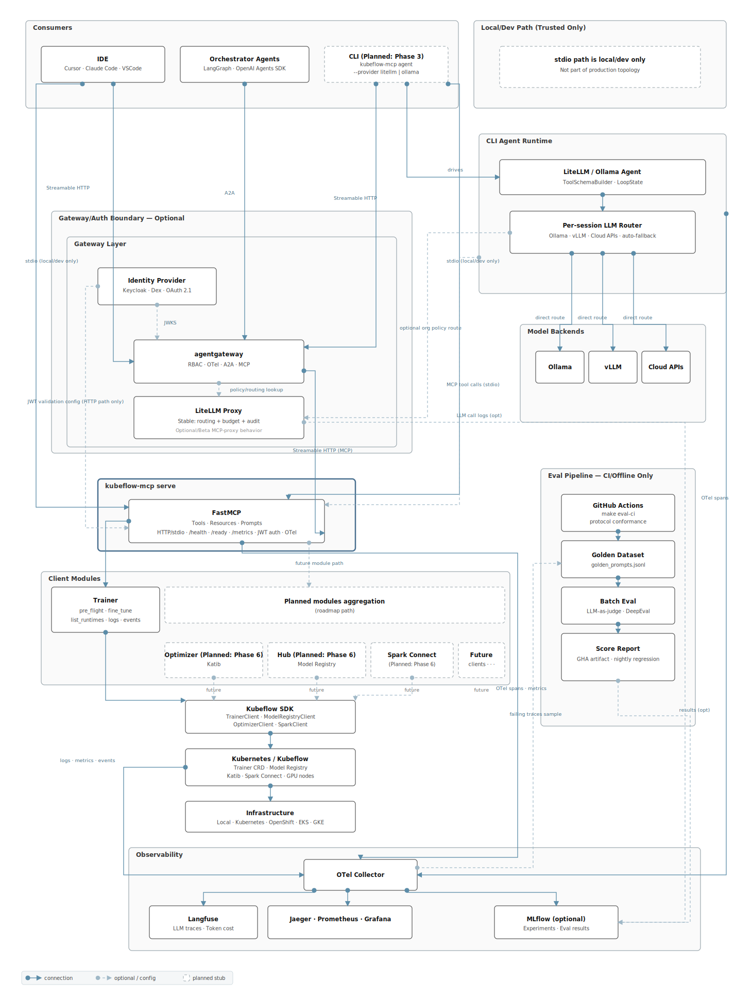

# Kubeflow MCP Server ROADMAP

This roadmap tracks the phased delivery plan for the Kubeflow MCP Server, as proposed in
[KEP-936](https://github.com/kubeflow/community/tree/master/proposals/936-kubeflow-mcp-server).
It covers the MCP server runtime only; higher-level toolkits and marketplaces
(for example, a `kubeflow/ai-toolkit` repo) are considered under future scope.

## 2026

### Phase 1 — Foundation (`Completed`)

- 23 trainer tools covering the full training lifecycle: planning, discovery, training, monitoring, and health
- Three tool loading modes (`full`, `progressive`, `semantic`) to control how many tools are exposed at once
- Role-based personas (`readonly`, `data-scientist`, `ml-engineer`, `platform-admin`) with per-role tool filtering
- Safe-by-default two-phase confirmation for all write operations (`confirmed=False/True`)
- HTTP bearer token and JWT authentication for secure remote access
- Built-in rate limiting, circuit breaking, and timeouts to protect the Kubernetes API
- Structured audit logs with contextual failure hints for every tool call

### Phase 2 — Production Readiness (`In Progress`)

- Anthropic tool-search and lazy-loading adapters to keep large tool sets manageable in context
- CI pipeline: cluster smoke tests, 75% coverage gate, PyPI release, and Docker image
- Full unit and integration test coverage from planning through training to monitoring
- Performance benchmarks (latency percentiles and token usage) for each tool loading mode
- Observability: per-tool call traces and metrics via OpenTelemetry, exportable to Prometheus, Jaeger, Grafana, and MLflow using standard `OTEL_*` env vars
- HTTP `/health` and `/ready` endpoints for Kubernetes liveness and readiness probes
- [Langfuse](https://langfuse.com/) trace sink wired at server level now; agent-session tracing added in Phase 3
- Automated eval pipeline with a golden prompt dataset, rule-based and LLM judges, a PR regression gate, and MCP protocol conformance checks; eval scores published to MLflow for experiment tracking
- IDE integration files (Cursor, Claude Code) committed to the repo for one-step setup

### Phase 3 — Multi-Provider Agent Architecture (`In Progress`)

- A common `AgentProvider` protocol so any LLM backend can be plugged in without touching core code
  - Plugin registry via Python entry-points for first- and third-party provider packages
  - `--provider` CLI flag with auto-discovery replacing the old hard-coded `--backend`
  - Built-in providers: `ollama` for local inference with thinking mode, and `litellm` routing to 300+ cloud and local models
  - Runnable example scripts per provider and a `docker-compose` reference for multi-model team setups
  - OTel spans emitted from the agent runtime for end-to-end trace continuity alongside Langfuse agent-session tracing

### Phase 4 — Enterprise & In-Cluster (`To Do`)

- Helm chart and Kustomize overlays for cluster deployment; stateless HTTP mode as the default for easy horizontal scaling, stateful only when interactive elicitation is needed
- OAuth 2.1 / OIDC gateway integration with per-user namespace scoping and standard discovery endpoints
- Per-user Kubernetes context wiring so each caller's identity flows through to the cluster — [kubeflow/sdk#281](https://github.com/kubeflow/sdk/issues/281)
- Resource quota checks before training jobs are submitted
- [agentgateway](https://github.com/agentgateway/agentgateway) for RBAC, OTel, and multi-server tool federation at the gateway layer
- [LiteLLM proxy](https://docs.litellm.ai/docs/simple_proxy) as a shared LLM control plane with per-team routing and budget enforcement
- Agent-to-agent (A2A) task delegation endpoint and MCP Server Card for HTTP auto-discovery; first-class consumer support for orchestrator frameworks (LangGraph, OpenAI Agents SDK)
- Coordination with [kubernetes-mcp-server](https://github.com/containers/kubernetes-mcp-server), [hf-mcp-server](https://github.com/huggingface/hf-mcp-server), and Spark MCP
- Cryptographic tool-call signatures via [AGNTCY Identity](https://github.com/agntcy/identity) for supply-chain trust
- Native MCP elicitation (`ctx.elicit()`) once clients adopt it; two-phase confirmation stays as fallback

### Phase 5 — Advanced Training (`To Do`)

- Checkpoint save and restore for interrupted training runs — [KEP-2777](https://github.com/kubeflow/trainer/issues/2777)
- Real-time training progress and live metrics during active jobs — [KEP-2779](https://github.com/kubeflow/trainer/tree/master/docs/proposals/2779-trainjob-progress)
- Dynamic job scaling and workspace snapshots — [kubeflow/sdk#48](https://github.com/kubeflow/sdk/issues/48)
- GPU allocation visibility for running TrainJobs — [kubeflow/sdk#159](https://github.com/kubeflow/sdk/issues/159)
- Multi-cluster training support — [kubeflow/sdk#23](https://github.com/kubeflow/sdk/issues/23)
- Support for TRL, Unsloth, and other LLM fine-tuning frameworks — [KEP-2839](https://github.com/kubeflow/trainer/issues/2839)

### Phase 6 — Additional Clients (`To Do`)

- **Optimizer (Katib)**: hyperparameter search, trial comparison, and optimal config suggestion
- **Hub / Model Registry**: model registration, promotion, lineage tracking, and comparison
- **Tool scalability**: middleware to reduce tool count in context and lazy-load rarely used tools
- **Pipelines** — [kubeflow/sdk#125](https://github.com/kubeflow/sdk/issues/125)
- **Spark** — [kubeflow/sdk#107](https://github.com/kubeflow/sdk/issues/107)
- **Feast** — [kubeflow/sdk#239](https://github.com/kubeflow/sdk/issues/239)
- **Notebooks & UI**: notebook tools, VS Code extension, and Slack/ChatOps integrations

## Graduation Criteria

- **Alpha** — Phase 1 complete; basic CI and passing unit + integration tests
- **Beta** — Phases 2 and 3 complete; observability live; gateway patterns documented; IDE configs validated
- **Stable** — Phases 4–6 complete; Trainer, Optimizer, and Hub validated end-to-end; full docs and support matrix published

See also the [Kubeflow SDK ROADMAP](https://github.com/kubeflow/sdk/blob/main/ROADMAP.md)
for complementary SDK work that this MCP server depends on.

## Target Architecture

