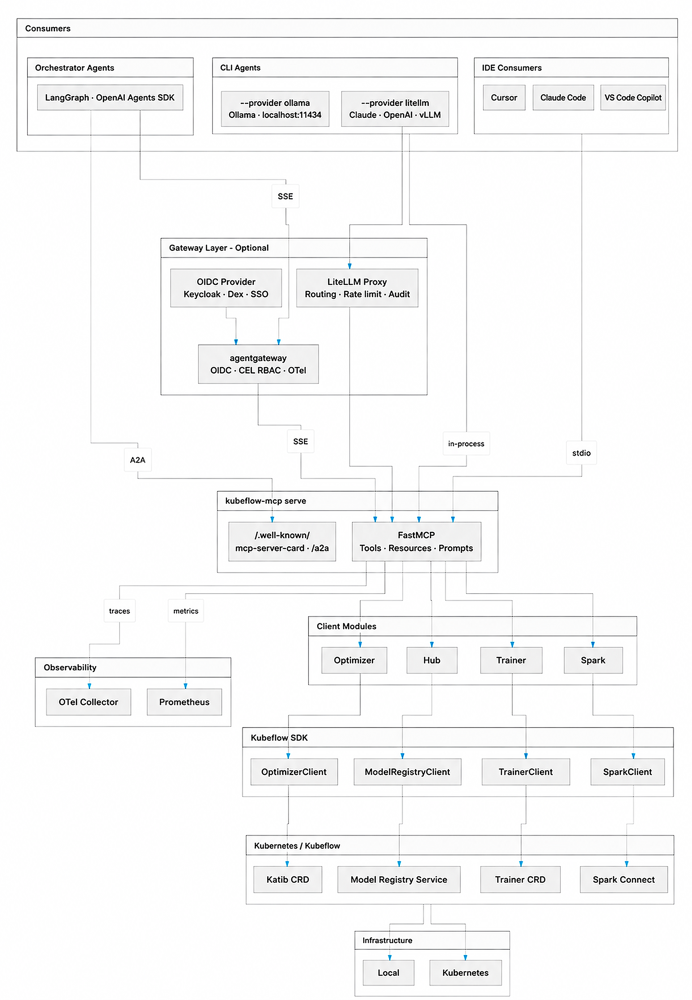

# Kubeflow MCP Server ROADMAP

This roadmap tracks the phased delivery plan for the Kubeflow MCP Server, as proposed in
[KEP-936](https://github.com/kubeflow/community/tree/master/proposals/936-kubeflow-mcp-server).
It covers the MCP server runtime only; higher-level toolkits and marketplaces
(for example, a `kubeflow/ai-toolkit` repo) are considered under future scope.

## 2026

### Phase 1 — Foundation (`Completed`)

- 23 trainer tools across planning, training, discovery, monitoring, lifecycle, and health phases
- Tool modes: `full`, `progressive`, `semantic`
- Persona and policy system: `readonly`, `data-scientist`, `ml-engineer`, `platform-admin`
- Two-phase confirmation for all mutating tools (`confirmed=False/True`)
- HTTP auth: bearer token and JWT verification
- Reliability controls: rate limiting, circuit breaking, timeouts
- Structured audit logging and failure hints

### Phase 2 — Production Readiness (`In Progress`)

- Identity → `TrainerClient` wiring (per-user kube context) — [kubeflow/sdk#281](https://github.com/kubeflow/sdk/issues/281)
- Anthropic `tool_search_tool` + `defer_loading` adapter
- CI: `kind` smoke tests, coverage gate (75%), PyPI release, Dockerfile
- Unit tests for all trainer tools and core modules; integration tests (plan → train → monitor)
- Performance benchmarks: P50/P95/P99 latency, token usage per mode (`make benchmark`)
- OpenTelemetry traces per tool call via [FastMCP instrumentation](https://gofastmcp.com/servers/telemetry)
- Prometheus `/metrics` endpoint; structured JSONL audit logs (HTTP mode)
- MLflow experiment tracking integration — [kubeflow/sdk#63](https://github.com/kubeflow/sdk/issues/63)
- Package layout: consolidate `src/kubeflow_mcp/agents/` into main package
- IDE config files committed to repo: `.cursor/mcp.json`, `.cursor/rules/kubeflow.mdc`, `CLAUDE.md`, `.mcp.json`

### Phase 3 — Multi-Provider Agent Architecture (`In Progress`)

- `AgentProvider` Protocol (`kubeflow_mcp/agents/base.py`) defining the provider contract
- Entry-point plugin registry (`[project.entry-points."kubeflow_mcp.providers"]`) for first- and third-party providers
- CLI: `--provider` with dynamic discovery (replaces hard-coded `--backend`)
- Built-in providers:
  - `ollama` — LlamaIndex FunctionAgent, local inference, thinking mode, rich terminal UI
  - `litellm` — universal provider via [LiteLLM](https://docs.litellm.ai/); routes to 300+ models with `--model ollama/qwen3:8b`, `--model claude-sonnet-4-5`, `--model openai/gpt-4o`, etc.
  - `ramalama` — OCI-based model runtime, targets air-gapped / RHEL / OpenShift deployments
- `examples/agents/` — standalone runnable script per provider
- `examples/deployment/litellm-gateway/` — `docker-compose.yml` reference for multi-model team setups

### Phase 4 — Enterprise & In-Cluster (`To Do`)

- Helm chart / Kustomize overlays; ServiceAccount + impersonation for StreamableHTTP
- OAuth2.1 / OIDC gateway pattern; per-user namespace scoping (Istio headers)
- ResourceQuota pre-flight checks
- [agentgateway](https://github.com/agentgateway/agentgateway): OIDC/JWT auth, CEL RBAC, OTel, tool federation
- [LiteLLM proxy](https://docs.litellm.ai/docs/simple_proxy): unified control plane for LLM routing and per-team auth
- A2A protocol endpoint (`/.well-known/agent` + `/a2a`) for agent-to-agent task delegation
- MCP Server Cards `/.well-known/mcp-server-card` (SEP-2127) for HTTP auto-discovery
- Coordination with [kubernetes-mcp-server](https://github.com/containers/kubernetes-mcp-server), [hf-mcp-server](https://github.com/huggingface/hf-mcp-server), Spark MCP
- [AGNTCY Identity](https://github.com/agntcy/identity) for cryptographic tool-call signatures
- MCP Elicitation via `ctx.elicit()` (blocked on client adoption; `confirmed` stays as fallback)

### Phase 5 — Advanced Training (`To Do`)

- Checkpoints: `list_checkpoints()`, `restore_checkpoint()` — [KEP-2777](https://github.com/kubeflow/trainer/issues/2777)
- Progress and metrics: `get_training_progress()`, `get_training_metrics()` — [KEP-2779](https://github.com/kubeflow/trainer/tree/master/docs/proposals/2779-trainjob-progress)
- Dynamic scaling: `scale_training_job()`; workspace snapshots — [kubeflow/sdk#48](https://github.com/kubeflow/sdk/issues/48)
- GPU visibility for active TrainJobs — [kubeflow/sdk#159](https://github.com/kubeflow/sdk/issues/159)
- Multi-cluster support — [kubeflow/sdk#23](https://github.com/kubeflow/sdk/issues/23)
- TRL, Unsloth, and other LLM trainer frameworks — [KEP-2839](https://github.com/kubeflow/trainer/issues/2839)

### Phase 6 — Additional Clients (`To Do`)

- **Optimizer (Katib)**: `create_experiment`, `list_experiments`, `get_optimal_trial`, `suggest_config`, `compare_trials`
- **Hub / Model Registry**: `register_model`, `list_models`, `promote_model`, `compare_models`, `get_model_lineage`
- **Tool scalability**: [mcp-optimizer](https://github.com/StacklokLabs/mcp-optimizer) middleware; Anthropic `defer_loading` adapter
- **Pipelines** — [kubeflow/sdk#125](https://github.com/kubeflow/sdk/issues/125)
- **Spark** — [kubeflow/sdk#107](https://github.com/kubeflow/sdk/issues/107)
- **Feast** — [kubeflow/sdk#239](https://github.com/kubeflow/sdk/issues/239)
- **Notebooks & UI**: notebook tools, VS Code extension, Slack/ChatOps integrations

## Graduation Criteria

- **Alpha** — Phase 1 complete; basic CI and passing unit + integration tests
- **Beta** — Phase 2 and 3 complete; OTel and Prometheus live; gateway patterns documented; IDE config files validated against Cursor and Claude Code
- **Stable** — Phases 4–5 complete; Trainer + Optimizer + Hub validated; multi-provider agents end-to-end tested; full docs site and support matrix published

See also the [Kubeflow SDK ROADMAP](https://github.com/kubeflow/sdk/blob/main/ROADMAP.md)
for complementary SDK work that this MCP server depends on.

## Target Architecture

