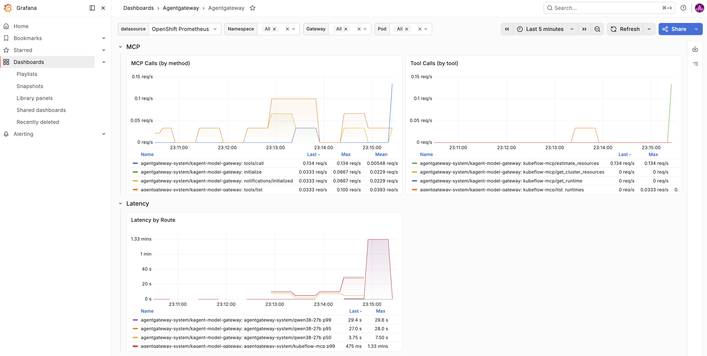

# Agentgateway for KAgent and Kubeflow MCP

This example deploys Agentgateway as the MCP routing and policy layer for
KAgent. Optional model routing can be added separately; Agentgateway remains a
separate component from the MCP server.

## Why use Agentgateway?

Agentgateway provides a centralized network and policy boundary for MCP traffic.
It gives KAgent a stable in-cluster endpoint while adding route-level controls,
authentication handling, rate limits, timeouts, and observability. The MCP
server remains independently deployable and can be reused by other clients.

## Reference observability views

The following panels show the signals to verify after traffic flows through the
Gateway. Metric names, labels, and dashboard sections depend on the Agentgateway
version and monitoring stack used by the cluster.


*Gateway resource usage and request volume.*



*MCP protocol calls, tool calls, and route latency.*


*Requests grouped by response status and reason.*

## Prerequisites

- Agentgateway installed with the `agentgateway` GatewayClass.
- Gateway API, Agentgateway CRDs, and NetworkPolicy support installed.
- KAgent and the Kubeflow MCP Service running in `kagent`.
- Prometheus Operator monitoring CRDs installed; this profile creates a `ServiceMonitor` and `PodMonitor`.
- An OpenTelemetry Collector and trace backend installed separately if distributed traces are required.
- Permission to create Gateway, HTTPRoute, Agentgateway, monitoring, and NetworkPolicy resources.

Install Agentgateway using the [official Kubernetes documentation](https://agentgateway.dev/docs/kubernetes/latest/documentation/).

The manifests use these neutral reference values:

- Gateway namespace: `agentgateway-system`
- MCP namespace: `kagent`
- MCP backend: the in-cluster Kubeflow MCP Service

The default Kustomization does not include model routing. Add a
provider-specific `AgentgatewayBackend`, `HTTPRoute`, and matching policy after
replacing the placeholder values in `backend.yaml`, `route.yaml`, and
`model-policy.yaml`.

## 1. Configure MCP gateway authentication

Create the upstream Secret using the secret-management process used by your
cluster:

```bash
export MCP_TOKEN='<the same token used by kubeflow-mcp-http-auth>'

kubectl create namespace agentgateway-system --dry-run=client -o yaml | kubectl apply -f -
kubectl -n agentgateway-system create secret generic kubeflow-mcp-upstream-auth \
  --from-literal=Authorization="Bearer $MCP_TOKEN" \
  --dry-run=client -o yaml | kubectl apply -f -
```

`MCP_TOKEN` must be the same value used to create `kubeflow-mcp-http-auth` in `examples/kagent`. Do not generate a second MCP token.

If an optional provider-specific model route is enabled, create its provider
credential Secret separately and keep it out of source control.

## 2. Apply the component

```bash
kubectl apply -k examples/agentgateway
```

The base does not set a platform-specific user ID, so the same manifests work
on Kubernetes distributions that assign namespace-specific UIDs.

This creates:

- An internal `ClusterIP` Gateway.
- `/mcp` Kubeflow MCP routing.
- Route-level rate limits and timeouts. Optional model routes add retries.
- Prometheus ServiceMonitor and PodMonitor resources.
- Gateway ingress isolation with NetworkPolicy.

The NetworkPolicy restricts application traffic to KAgent and permits metrics
scraping from the `monitoring` namespace. If Prometheus runs elsewhere, update
the NetworkPolicy before applying the profile.

Agentgateway metrics and MCP traces are complementary: use Prometheus for aggregate traffic and latency, and the OpenTelemetry pipeline for an individual request across the stack.

The internal endpoint is:

```text
http://kagent-model-gateway.agentgateway-system:80
```

If a provider-specific `/v1` route is configured, point KAgent’s ModelConfig at
that route. For an existing ModelConfig, the base URL typically resembles:

```text
http://kagent-model-gateway.agentgateway-system.svc.cluster.local/v1
```

Keep the existing model name and API-key Secret reference. The KAgent
`RemoteMCPServer` uses `/mcp` at the same endpoint. Set the provider name, model
name, and credential reference to match your model service.

For a KAgent installation that already has a ModelConfig, the update is equivalent to:

```bash
kubectl -n kagent patch modelconfig <model-config-name> --type merge \
  -p '{"spec":{"openAI":{"baseUrl":"http://kagent-model-gateway.agentgateway-system.svc.cluster.local/v1"}}}'
```

Keep the existing model name and credential reference when applying this patch.

## 3. Validate

```bash
kubectl get gateway,httproute,agentgatewaybackend,agentgatewaypolicy \
  -n agentgateway-system
kubectl get servicemonitor,podmonitor,networkpolicy -n agentgateway-system
```

The Gateway must report `Programmed=True`; routes and backends must be accepted and resolved.

## Operational limitations

- The MCP backend currently uses a static target and one proxy replica. Do not scale the proxy horizontally until session affinity is configured for the MCP target.
- Frontend OAuth2/JWT authentication is not enabled. The Gateway is internal, and the MCP server still validates its upstream bearer token. Add identity policy before exposing the Gateway outside the cluster.
- The MCP route allows 60 requests per minute with a burst of 20. Tune this limit for the expected number of agents and MCP session initialization calls.
- Optional model routes retry transient 5xx responses only. 429 responses are not retried to avoid amplifying provider throttling or duplicating billable requests.

See the [Agentgateway Kubernetes documentation](https://agentgateway.dev/docs/kubernetes/latest/documentation/).
