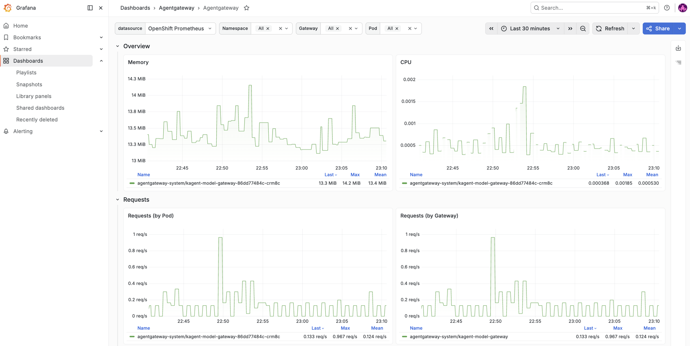
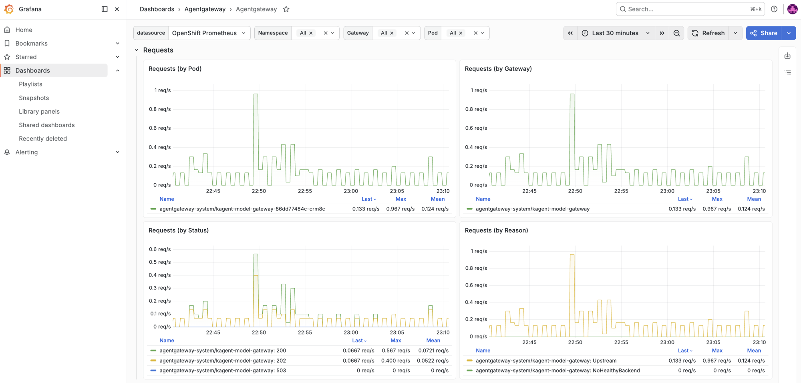

# Grafana dashboards for Kubeflow observability

This example deploys Grafana through the Grafana Operator and provisions
Prometheus and Tempo datasources. It uses standard Kubernetes resources only.
Configure authentication and external exposure for your environment using an
Ingress, Gateway API, or port-forward.

## Prerequisites

- The Grafana Operator is installed.
- A Prometheus-compatible endpoint is reachable from the `observability`
  namespace.
- A Tempo-compatible endpoint is available if trace queries are required.
- The Agentgateway metrics used by the dashboards are enabled and scraped.

## Configure and deploy

Before applying, update the Prometheus and Tempo service URLs marked in
[`datasources.yaml`](datasources.yaml) for the monitoring stack in your
cluster. If the Prometheus endpoint requires authentication, configure the
datasource Secret through your platform's secret-management mechanism.

```bash
kubectl apply -k examples/grafana
kubectl get grafana,grafanadashboard,grafanadatasource -n observability
```

Use the Grafana Service created by the operator, or port-forward it for a
local check:

```bash
kubectl port-forward -n observability svc/kubeflow-observability-service 3000:3000
```

The provisioned dashboards are:

- `Agentgateway`: upstream Agentgateway dashboard
- `Agentgateway Resources`: CPU and memory panels
- `Kubeflow MCP`: MCP request and tool-call panels

Dashboard queries depend on the metric names and labels emitted by the
installed Agentgateway version. Verify them with the Prometheus expression
browser before treating an empty panel as an application failure.

The upstream Agentgateway dashboard is fetched from its pinned release URL;
the Grafana Operator must be able to reach that URL. Replace the `url` field in
`agentgateway-dashboard.yaml` with an inline dashboard definition when the
cluster has no outbound access.

## Example dashboards






These captures show the dashboard views available after traffic has passed
through Agentgateway. The live values depend on the selected time range and
traffic in your cluster.
