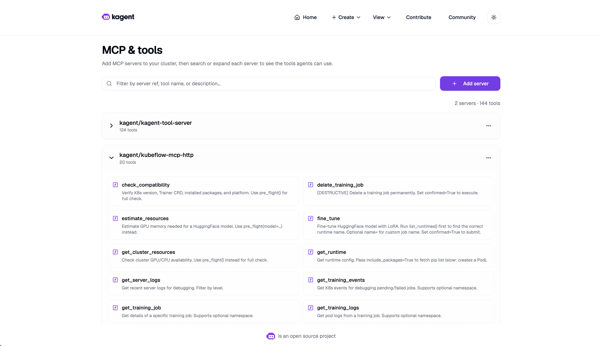
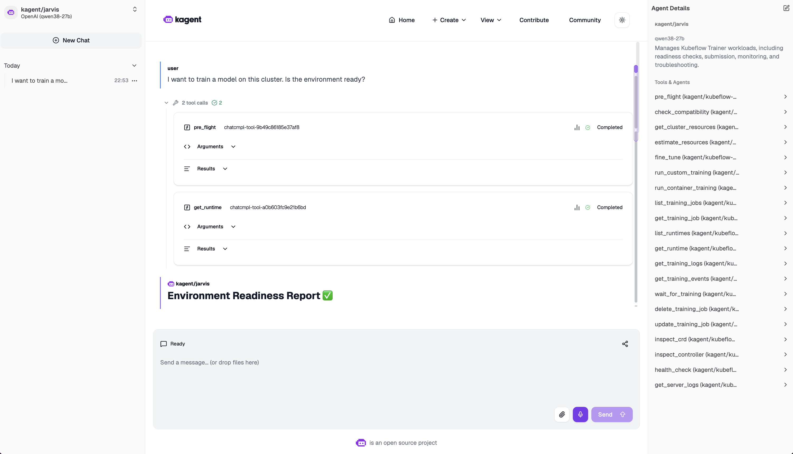
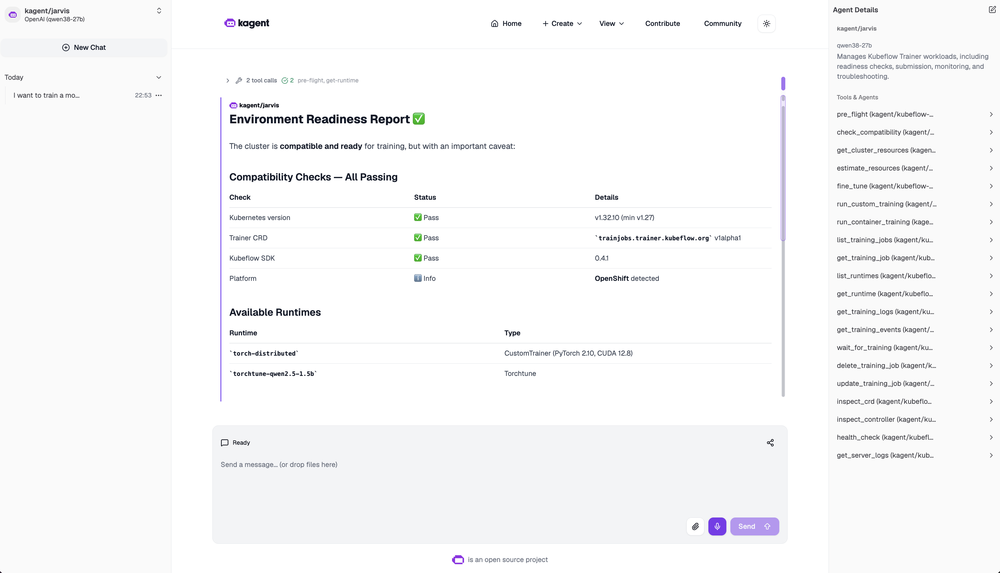
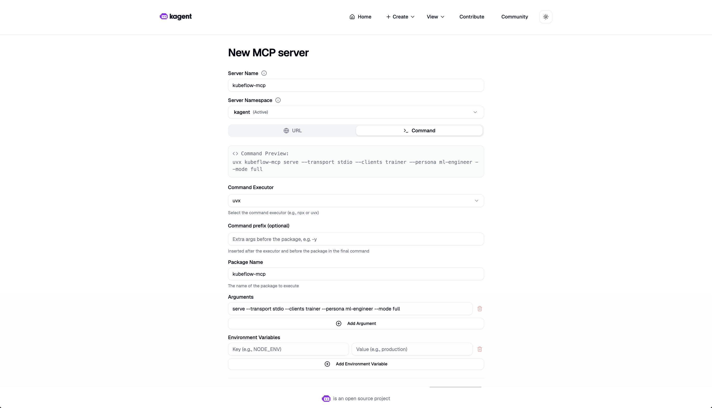

# KAgent with Kubeflow MCP Server

This example deploys the Kubeflow MCP Server over authenticated Streamable HTTP and registers it with KAgent. It assumes that KAgent and Kubeflow Trainer are already installed; it does not install KAgent, Trainer, Agentgateway, or a model provider.

## Why use KAgent?

KAgent provides the agent runtime that turns natural-language requests into
controlled Kubeflow operations. It discovers the MCP tools, applies the
configured identity and permissions, and presents training readiness, resource,
submission, and monitoring workflows through one agent interface. Kubeflow
resources remain authoritative in the Kubernetes API.

## Reference workflow

The following captures show the expected user-facing results after registration.



*The KAgent catalog shows Kubeflow MCP registered alongside the platform's existing tools.*



*A natural-language request invokes MCP tools and returns compatibility checks and available runtimes.*



*The agent explains the cluster's available resources and recommends an appropriate training path before submission.*

## Prerequisites

- KAgent installed in the `kagent` namespace.
- Kubeflow Trainer installed and its CRDs available.
- `agents.kagent.dev`, `remotemcpservers.kagent.dev`, and Trainer CRDs installed.
- Agentgateway installed with the `agentgateway` GatewayClass and Gateway API CRDs.
- Permission to create the ServiceAccount, cluster-scoped RBAC, Deployment, Service, and RemoteMCPServer.

The reference RBAC permits Trainer mutations only in the `kagent` namespace. Extend it deliberately if workloads must be managed elsewhere.

Install KAgent and Trainer using the [KAgent documentation](https://kagent.dev/docs/kagent/0.x/introduction/installation/) and [Kubeflow Trainer documentation](https://www.kubeflow.org/docs/components/trainer/overview/).

## 1. Create the MCP credentials

Create the token with the secret-management process used by your cluster:

```bash
export MCP_NAMESPACE=kagent
export MCP_TOKEN="$(openssl rand -hex 32)"

kubectl create namespace "$MCP_NAMESPACE" --dry-run=client -o yaml | kubectl apply -f -
kubectl -n "$MCP_NAMESPACE" create secret generic kubeflow-mcp-http-auth \
  --from-literal=KUBEFLOW_MCP_AUTH_TOKEN="$MCP_TOKEN" \
  --dry-run=client -o yaml | kubectl apply -f -
printf 'Bearer %s' "$MCP_TOKEN" | kubectl -n "$MCP_NAMESPACE" \
  create secret generic kubeflow-mcp-http-header \
  --from-file=AUTHORIZATION=/dev/stdin --dry-run=client -o yaml | kubectl apply -f -
```

## 2. Apply the MCP component

Review [`deployment.yaml`](deployment.yaml) and set the MCP image to the
required image tag for your environment. The example uses the latest published
image; pin it deliberately when reproducibility is required. Apply the component:

```bash
kubectl apply -k examples/kagent
kubectl rollout status deployment/kubeflow-mcp-http -n "$MCP_NAMESPACE"
```

To enable tracing, use the combined [`examples/kagent-observability`](../kagent-observability/README.md) bundle instead. The plain KAgent example does not require the OpenTelemetry Operator.

The internal MCP Service endpoint is:

```text
http://kubeflow-mcp-http.<namespace>:8000/mcp
```

The `RemoteMCPServer` resource points to the Agentgateway endpoint. Apply
`examples/agentgateway` before applying this profile or starting an Agent that
uses this registration.
The Service is an internal Agentgateway target. The NetworkPolicy restricts
application traffic to the Agentgateway namespace.

For local or development-only stdio registration, KAgent's command form can launch
the package directly with `uvx`. This starts a separate MCP process and is not a
replacement for the deployed HTTP server:

```text
uvx kubeflow-mcp serve --transport stdio --clients trainer --persona ml-engineer --mode full
```



## 3. Use the MCP server from KAgent

The `RemoteMCPServer` manifest registers `kubeflow-mcp-http` with KAgent. Once
the resource is accepted, start a new Agent chat and confirm that the MCP tools
are listed. If you manage Agents declaratively, reference this resource from the
Agent definition instead of adding a second registration.

## 4. Validate

```bash
kubectl get remotemcpserver kubeflow-mcp-http -n "$MCP_NAMESPACE"
kubectl get deployment,service,pods -n "$MCP_NAMESPACE" \
  -l app.kubernetes.io/name=kubeflow-mcp-http
```

The RemoteMCPServer must be accepted and expose tools such as `pre_flight`, `list_training_jobs`, `fine_tune`, and `health_check`. Run `pre_flight` before submitting a workload.
