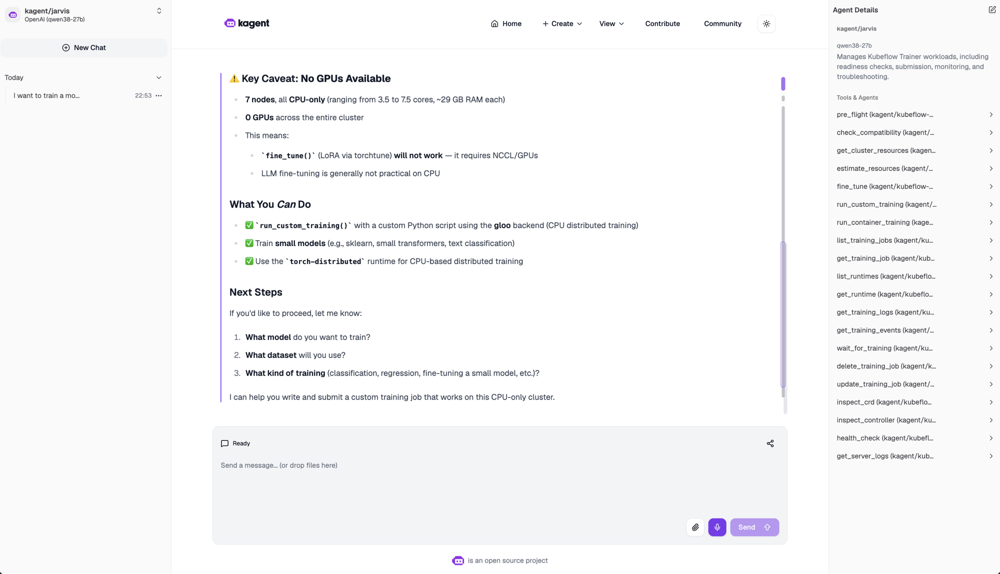

# OpenTelemetry Collector for Kubeflow MCP

This example deploys an OpenTelemetry Collector using the OpenTelemetry
Operator. It receives OTLP/HTTP traces from the MCP server when the combined
bundle is used.

## Prerequisites

- The OpenTelemetry Operator and `OpenTelemetryCollector` CRD are installed.
- The `kagent` namespace exists when this collector is used with the combined
  `kagent-observability` profile.
- A trace backend such as Tempo or Jaeger is installed if traces must be viewed in a dashboard.

## Deploy

```bash
kubectl apply -k examples/observability
```

For a single deployment that also configures MCP trace export, use [`examples/kagent-observability`](../kagent-observability/README.md) instead.

When used with `examples/kagent-observability`, the MCP deployment sends traces
to the collector Service created by the Operator:

```text
http://otel-collector-collector.observability.svc.cluster.local:4318
```

Verify the collector and MCP deployment:

```bash
kubectl get opentelemetrycollector,pods,svc -n observability
```

The default collector uses the `debug` exporter so the pipeline can be validated
before a trace backend is configured. Collector logs should show received spans:

```bash
kubectl logs -n observability deployment/otel-collector
```

## Connect a trace backend

The Operator does not provide storage or a dashboard. Configure the collector's `traces` pipeline with an OTLP exporter pointing to the approved Tempo or Jaeger service, then view traces in Grafana or the platform tracing UI. Do not expose the collector publicly.

Tracing requires the `OTEL_EXPORTER_OTLP_ENDPOINT` environment variable.
Export failures do not block tool calls.

## Example trace view



This is an example `tools/list` span emitted by the MCP server, including the
MCP method, session, and OpenTelemetry attributes. Use the trace backend and
service names configured for your cluster.
